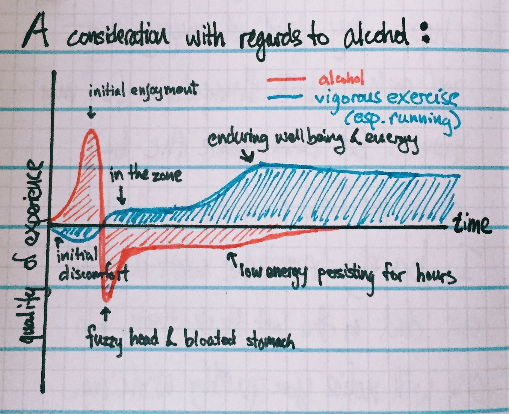

# The Codex Vitae of David Howell

This is a place for me to store statements of my long-term goals, [GTD][1] horizons, and affirmations of my beliefs and values. Inspired by Buster Benson and his [Codex Vitae][2].

## Beliefs

I want to solve more problems than I create, clean up more messes than I make.

Consciousness is immanent in the mind and body. There is no separate "soul-stuff" transcendent from the material universe. Sense of self is a process enacted continuously.

A human life has no cosmic, unambiguous purpose: we have the opportunity and responsibility to find and make that choice on our own, between ourselves. But meaning and choice are constrained by our physical and social environment: the skills we learn and the communities of practice we inhabit shape the possible sources of meaning available to us.

> I think "do what you love" is useless advice when it comes to making a living. I'd recommend looking at what the world needs, thinking about what you have to offer, and working hard to build a skillset so that you can fill that void.
> -- Austin Kleon

Humans are the products of evolution, inhabiting an environment that is far from any kind of equilibrium. Your instincts are optimized for propagation of genes and no more: for sustainable happiness in life, do not take your impulses as truth. Instead, be mindful of how small choices accumulate over the long term.

	1.01^365 = 37.8
	0.99^365 = 0.03

Satisfaction comes from fulfilling our responsibility to others, from learning new things, from challenging ourselves, and only marginally from experiencing pleasure.

The arrow of time is real. Although microscopic dynamics are time-reversible, the universe is a system at the thermodynamic limit and the second law of thermodynamics gives time a directionality. **The laws of physics may be deterministic, but the future is not determined** (See Ilya Prigogine's _The End of Certainty_ for a detailed argument).

In general, question conclusions derived from extrapolating clean-room, microscopic, spherical-cow thought experiments to macroscopic situations. _Everything_ is situated in contexts that violate the assumptions of the thought experiment.

We must often gain  _experiential knowledge_ of a theoretical system's virtues before we can develop our full understanding. We find and embrace strategies that help us achieve equanimity and construct the discourse to explain those strategies. Even a fully developed philosophical/spiritual theory has to be taught and learned via _spiritual exercises_ (See Pierre Hadot's _Philosophy as a Way of Life_ for an extended version of this argument, relating to Platonic Christian theology and the Stoics). **Before we can believe, we must act.** The experiential knowledge that produces motivation often fades within days, unless reinforced by ritual and practice.

**Action precedes motivation**.

The self is not sharply bounded by the skin: mind is embodied in its environment (See Andy Clark's _Supersizing the Mind_). When I speak to another human, we become a distributed cognitive network through the sensory connections (sight, sound, smell) between our nervous systems.

Long-term satisfaction in life depends at least partly on **discovering what your values are** and trying to **live in conformity with those values**. But remember that there is no true, eternal, stable self. You and your values are path-dependent and dynamic -- so choose your paths well.

## Activities & Their Ends

### Exercise

Exercise will help me maintain my physical health and support a high quality of life as I age.

Exercise improves my mood. Consistent exercise is critical to keeping depression at bay.

Exercise supports better mental clarity. I have greater focus, I'm better at problem solving, and I'm better at making creative connections when I exercise.

I am not necessarily high-activity by inclination, but I **need** high activity to feel like me.

### Writing

Maintaining a journal provides me a daily opportunity to shift my perspective and help me evaluate whether I am living a life guided by reason and justice.

Writing down summaries of what I read and my response to that reading will help me retain what I’ve learned better and think more logically.

### Reading

Most of the problems in life are not new. I have access to most of the collected wisdom and ideas of nearly three millennia of written history, which can serve to enrich my life and guide me towards flourishing.

Novels are one of the most effective methods ever invented to challenge perspectives and stretch the mind.

### Meditation

Kindness and empathy require patience. Meditation is the surest way I know to train deliberately for patience.

I am not my thoughts. My thoughts are sensations, like sights and sounds that I observe. When I see something or hear something, I don't immediately identify that sight or sound as "me". The same should be true of my thoughts.

Who is the "I" that would even identify with thoughts?

## Worthwhile Tools

### _annotated bibliographies_

Organize your thoughts on a topic, in a shape that you can retrace and build upon. Make your study tangible.

### [_kiloslog_][kiloslog]

Progress towards a large goals happens in small steps forward: track the thousand slogging steps towards your goal to cement who you are becoming.

### _sketchnoting_

The practice of doodling and drawing out ideas -- even if just writing stylized text -- improves your memory and delight in learning.

### _commitment devices_

When we are in a long-term frame of mind (more than one week out), it is easy to set parameters for what we should do, but short-term incentives can often override and undermine those long-term ideals. Use contracts and other commitment devices to lock oneself into good ideas (see [Beeminder][bee]).

### _celebrate successes_

Internalizing successes and progress can be difficult. Continue to challenge yourself, but give yourself **genuine rewards** to celebrate your successes. Write down _why_ you earned the reward - whether it is a cocktail, watching a movie, or buying yourself a fancy notebook (See Lara Hogan's [Donut Manifesto][donuts]).

[kiloslog]:	https://medium.com/@buster/1-metric-kiloslog-52167e196771 "1 Metric Kiloslog"
[bee]: https://www.beeminder.com/dehowell
[donuts]: http://larahogan.me/donuts/

## Traps

These are pitfalls and experiential truths that are easy to lose sight of without regular consideration.

1. Alcohol - fancy cocktails and craft beer - is not a prerequisite to the good life, despite prevailing attitudes in Vermont. It can be enjoyed occasionally, but at best will be a fleeting pleasure. At worst, alcohol makes concentration and good judgement difficult and will tend to undermine progress towards a deeper life.
	
2. Attachment to your house is proportional to energy invested into it. If the house is treated as an abstract shell, it will be an encumbrance. If tended and considered, it will be a joy and pleasure for your family.
3. Frugality is a virtue, but it is not a virtue to be stingy when spending money can help you live truer to your values.
4. It can be powerful to have _high expectations_ for myself, but I must be careful to not apply those same expectations to other people. With others, strive to accept their limitations and interests.

## Core Curriculum

This is a collection of articles, books, and otherwise that have influenced me, in ways conscious our otherwise.

Intended to help me develop clarity of purpose in the midst of an overwhelming volume of interests.

- **Peter Adeney**. ["The Practical Benefits of Outrageous Optimism"](http://www.mrmoneymustache.com/2012/10/03/the-practical-benefits-of-outrageous-optimism/).  
  Although I read Martin Seligman's _Learned Optimism_ first, the Mr. Money Mustache treatment of the subject (and his writing in general) has done far more to help me get my attention directed towards the things that I can change in my life - and also helped me understand that I can embrace my own skills and success without giving up on my moral beliefs and desire to see a more just world.
- **Seneca**. [_Letters from a Stoic_](http://www.penguin.com/book/letters-from-a-stoic-by-seneca/9780140442106)
- **Francis Edward Su**. ["The Lessons of Grace in Teaching"](http://mathyawp.blogspot.com/2013/01/the-lesson-of-grace-in-teaching.html)
- **Venkatesh Rao**. ["A Calculus of Grit"](http://www.ribbonfarm.com/2011/08/19/the-calculus-of-grit/)
- **Manuel DeLanda**. _A Thousand Years of Non-Linear History_
- **James C. Scott**. _Seeing Like a State_
- **Buster Benson**. ["1 Metric Kiloslog"](https://medium.com/@buster/1-metric-kiloslog-52167e196771)
- **Buster Benson**. ["Like Like a Hydra"](https://medium.com/@buster/live-like-a-hydra-c02337782a89)
- **James Somers**. ["Speed Matters"](http://jsomers.net/blog/speed-matters)  
  This article connected things I have known to be true at the team level back to my individual habits. Namely, in a queueing system, _decrease latency to increase throughput_. Having slack and available capacity is a precondition for doing interesting work. So work - and finish - fast!
- **Cal Newport**. ["Knowledge Workers are Bad at Working"](http://calnewport.com/blog/2012/11/21/knowledge-workers-are-bad-at-working-and-heres-what-to-do-about-it/)  
  Professionals in several disciplines have cultures of _systematic improvement_, but software developers (and many other knowledge workers) put far too much of their effort into email instead of deep work that grows their skill set.
- **Dorian Taylor**. ["Toward a Theory of Design as Computation"](http://doriantaylor.com/toward-a-theory-of-design-as-computation)
- **John Gruber**. ["Untitled Document Syndrome"](http://daringfireball.net/2009/02/untitled_document_syndrome)
- **David Heinemeier Hanson**. ["Reconsider"](https://signalvnoise.com/posts/3972-reconsider)
- **Cal Newport**. ["Getting Started is Overrated"](http://calnewport.com/blog/2008/06/27/dangerous-ideas-getting-started-is-overrated/)  
  Cal Newport counters the advice "just get started", referencing the dangers of survivorship bias. Getting started is a necessary but not sufficient condition for completing a pursuit successfully. Frequent starting also runs the risk of diluting your effort in other pursuits.  
    > If you translate every burst of enthusiasm into action, you're going to waste time. More dangerous, you're going to hobble your chances of succeeding in any pursuit, as the constant influx of new activity prevents you from achieving a Steve Martin-style diligence.

- **Cal Newport**. ["Do Goals Prevent Success?"](http://calnewport.com/blog/2014/07/31/do-goals-prevent-success/)  
  Cal Newport introduces the idea of _effectuation_ (coined by Saras Sarasvathy) as a candidate explanation for the disproportionate impact some people have in their fields. Effectuative thinking is a planning mode that focuses on (a) navigating from strengths and (b) avoiding risks with unbounded or large downsides (smells like optionality / anti-fragility) in order to allow goals to develop emergently - as opposed to top-down goal-first planning.
- **Charles Mann**. ["How to Talk About Climate Change so People Will Listen"](http://www.theatlantic.com/magazine/archive/2014/09/how-to-talk-about-climate-change-so-people-will-listen/375067/)
- **Robert Pirsig**. _Zen and the Art of Motorcycle Maintenance_
- **Nate Soares**. [Replacing Guilt](http://mindingourway.com/guilt/). A series of blog posts on how guilt and shame are toxic motivational forces, plus strategies for replacing them with more effective, intrinsic motivation.

[1]:	http://gettingthingsdone.com "Getting Things Done"
[2]:	http://wayoftheduck.com/codex-vitae "Codex Vitae"
